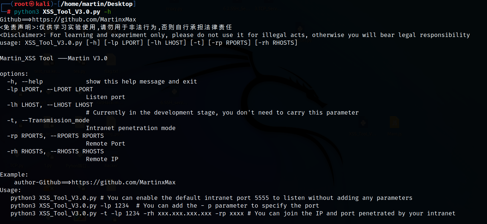
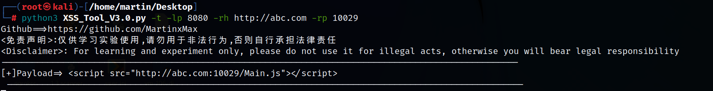
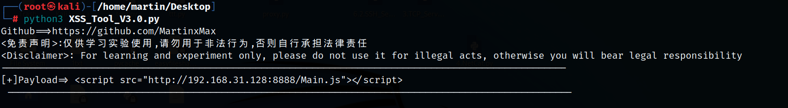
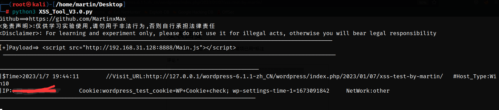

# XSS steals cookies
* The current version v3.0 is simpler and faster
* Obtain the victim's Internet IP address
* Python version 3.6 or above
* Automatically steal cookies
* Compatible with Windows or Linux
## usage method
  * View help information

      ```#python3 XSS_Tool_V3.0.py -h```

    

  * LAN attack

      ```#python3 XSS_Tool_V3.0.py -lp (Local port)```

  * Internet attack

      ```#python3 XSS_Tool_V3.0.py -t -lp (Local port) -rh (Remote host IP) -rp (Remote host port)```

## Effect demonstration 
 * We will use WordPress-6.1.1 for XSS attack simulation test
 * _If your machine has a public IP address, just listen to the local port_

# Use Extranet attack
* Enable port forwarding (Ngrok is used for demonstration)

      


* Use Extranet attack

    ```#python3 XSS_Tool_V3.0.py -t -lp 8080 -rh ***.***.***.*** -rp 10029```

      


# Use Intranet attack [Now Test]
-----------------Hacker--------------------------
* You can use the - lp parameter to specify the port. If you do not write, the default port is 8888

```#python3 XSS_Tool_V3.0.py```

  

* Copy payload and inject XXS injection point

  

----------------Server Admin------------------------

* Normal status of administrator

  

* The administrator was hacked to execute malicious code when viewing comments

  

-----------------Hacker--------------------------
* Hacker gets the administrator's cookie

