# Martin_XSS_V3.5.2
* Update redirection module,You can make XSS worms
* Update Form Hijacking
* Python version 3.6 or above
* Obtain the victim's public IP address and cookie
* Social engineering, obtaining account password
* Compatible with Windows or Linux
## usage method
  * View help information

      ```#python3 XSS_Tool_V3.5.2.py -h```

    

  * Intranet attack

      ```#python3 XSS_Tool_V3.5.2.py (-lp xxxx)```

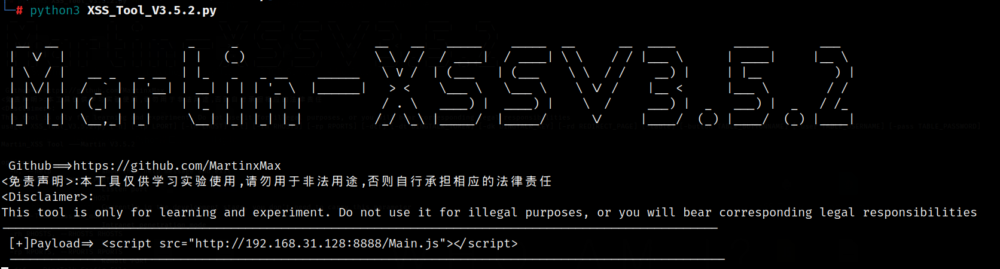  

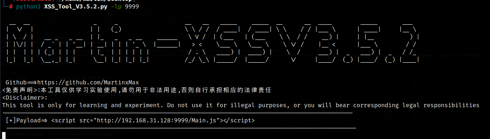  


  * Internet attack

    ```#python3 XSS_Tool_V3.5.2.py -t -rh [Remote host IP] (-rp Remote host port)```

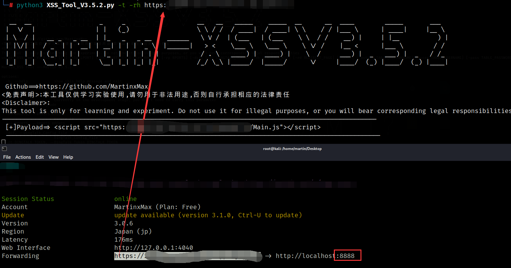  

* Redirect attack

```#python3 XSS_Tool_V3.5.2.py -rd xxxxx```

 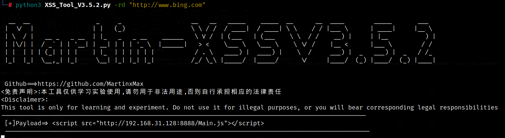  
* Push Message
1. 
    
```#vim DingTalk.conf```

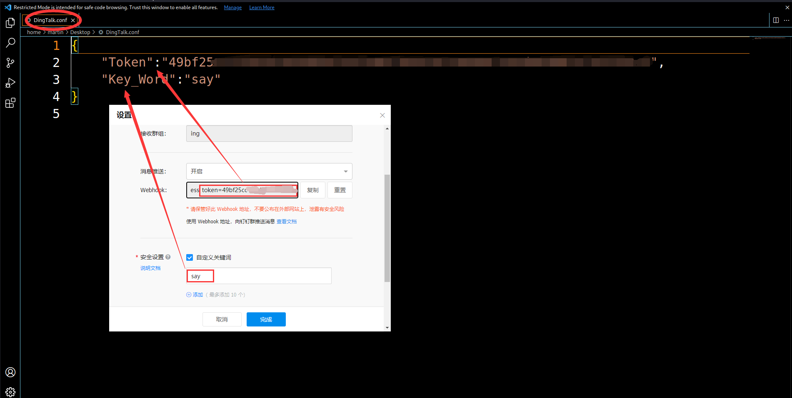  

```#python3 XSS_Tool_V3.5.2.py -dcf```
 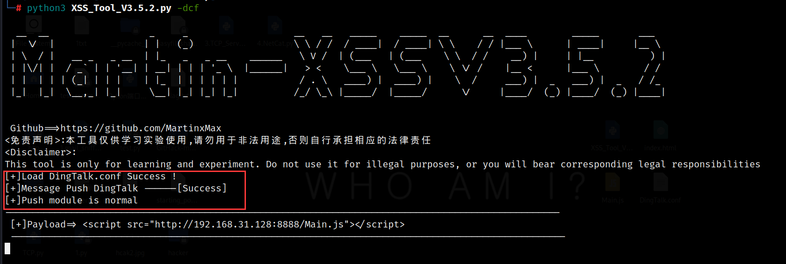  

2. 
    ```#python3 XSS_Tool_V3.5.2.py -dt xxx -dk xxx```

 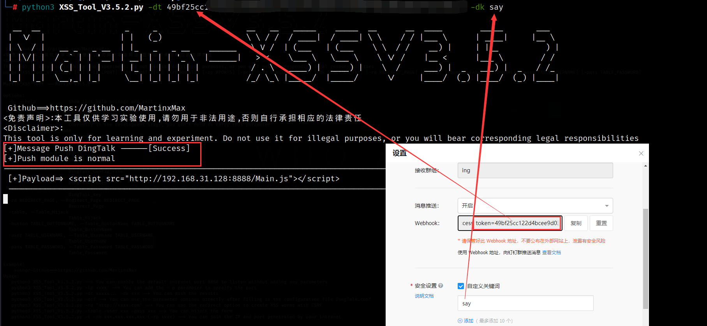 

# Use Intranet attack [Example: push message module combination]
 * _If your machine has a public IP address, just listen to the local port_
 * _You can not specify the port. The default port is 8888_
 
-----------------Hacker--------------------------

```#vim DingTalk.conf```


```#python3 XSS_Tool_V3.5.2.py -dcf```

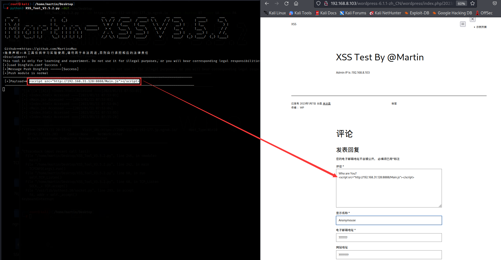  

* Copy payload and inject XXS injection point


----------------Server Admin------------------------
* Admin Cookie

  

* The administrator was hacked to execute malicious code when viewing comments

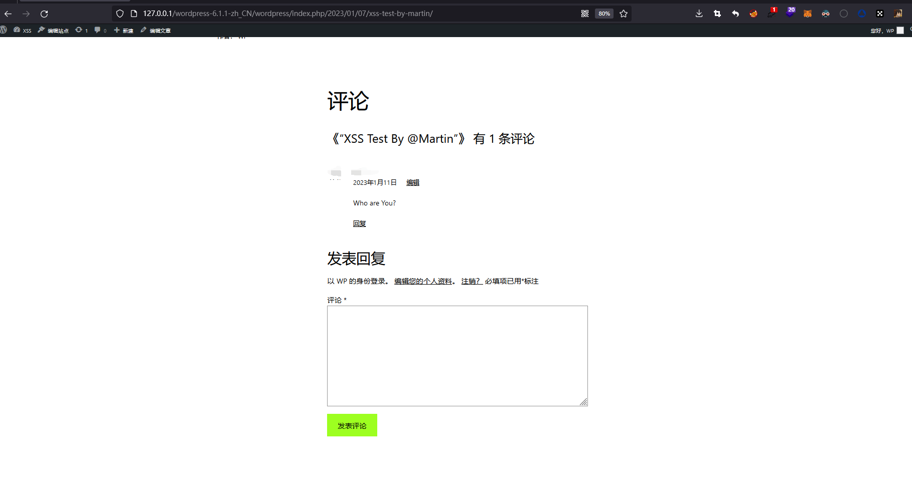  

-----------------Hacker--------------------------
* Hacker gets the administrator's cookie

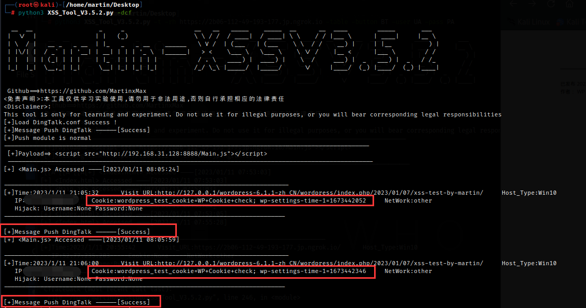
* Auto Push Message

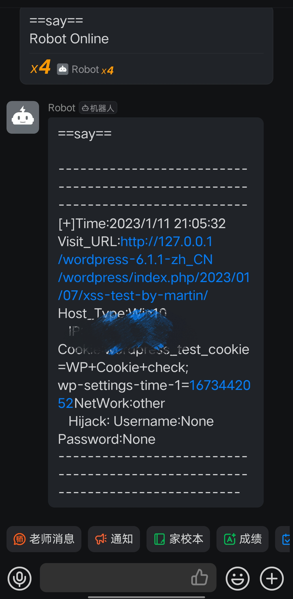

# Use Internet attack [Example:Social engineering]
* Modify code

```vim Index.html```

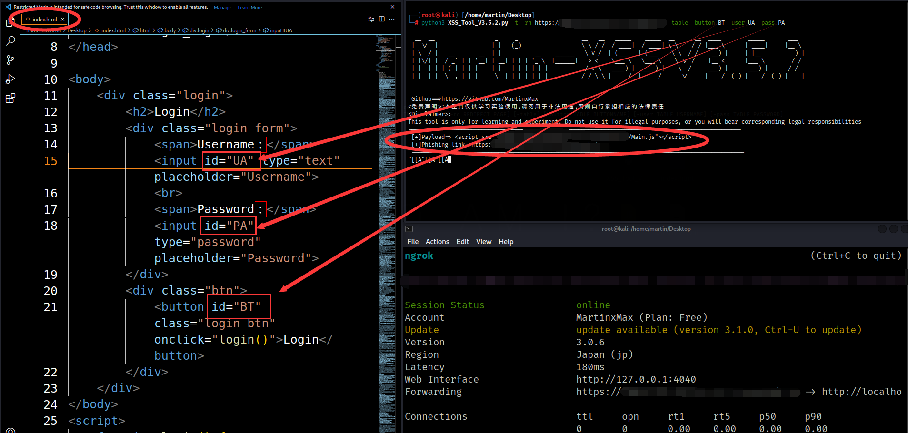  

* The victim visits the phishing link

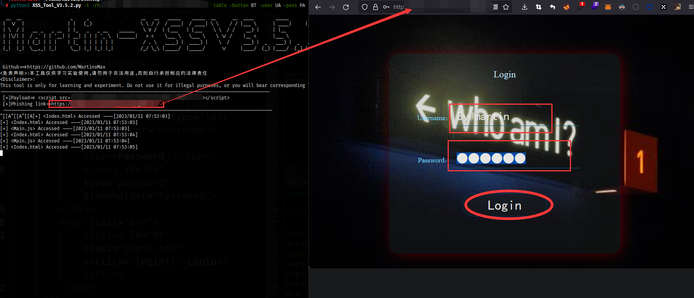

* Wait for submission. The hacker obtains the plaintext account password

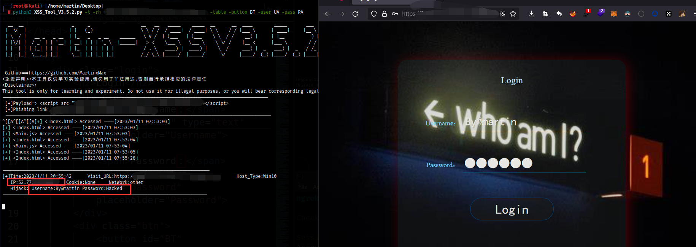


# Use Intranet attack [Example:Redirection+CSRF]

* Normal user
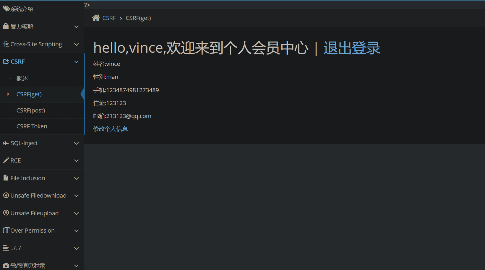
* Hacker inject code into web pages
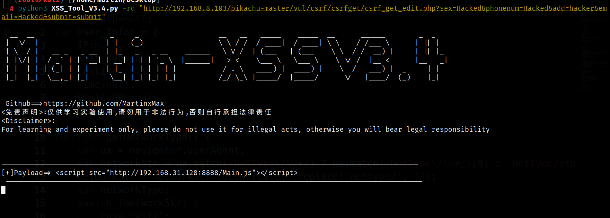
* User data is maliciously modified
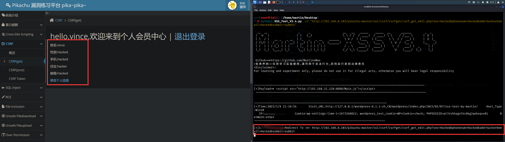